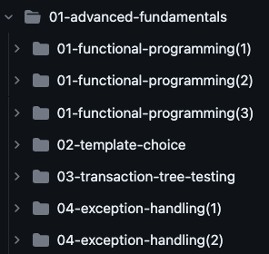
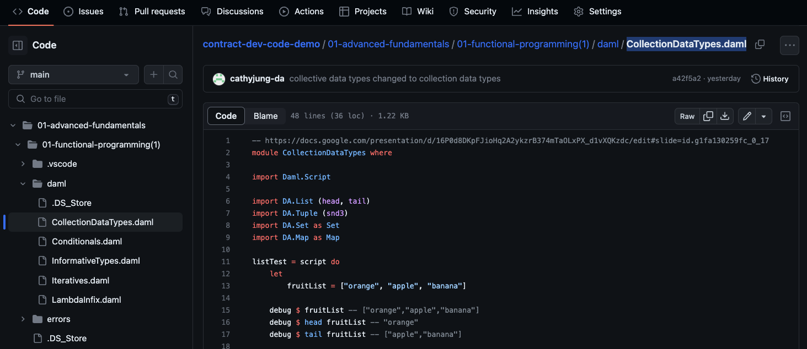

Copyright (c) 2023 Digital Asset (Switzerland) GmbH and/or its affiliates. All Rights Reserved.
SPDX-License-Identifier: Apache-2.0

# TLMS Contract Developer Code Demo

Hi, Damlers! Welcome to the **tlms-cd-code-demo** repository -- a hub for all the code demonstrations featured in the [Contract Developer certification program on TLMS.](https://daml.talentlms.com/dashboard/index/role:learner)

This repository has been created to assist you in enhancing your comprehension of the technical lessons. We encourage you to clone this repository to gain deeper insights into the code demonstrations presented throughout the course.

## Repository Structure
At the top level of the repository, you will find folders representing each course within the Contract Developer certification program. For example, the `01-advanced-fundamentals` folder corresponds to the "Advanced Fundamentals" course.

Within each course folder, you will find subfolders representing individual lessons within the course. For instance, the `01-functional-programming(1)` folder inside `01-advanced-fundamentals` corresponds to a specific lesson within the "Advanced Fundamentals" course.

The daml directory within each lesson folder contains the code demos used for specific slides within the lesson. For example, the file `CollectionDataTypes.daml` contains the code demo used for the "Collection Data Types" slide within the lesson. These code demos are designed to illustrate and clarify the main concepts covered in each lesson.

## Intentional Errors in Code Demos
Please note that deliberate errors may be present in the code demos to highlight specific error scenarios to the audience. If you encounter errors in the code, please refer to the corresponding video lesson on TLMS to confirm whether the error is intentional or not before making a pull request to fix it.

## Repository Updates
This repository is regularly updated whenever there are updates to the code demos used in the lessons. You can stay up to date by pulling the latest changes from the repository.

## Questions and Concerns
If you have any questions or concerns about the code demos or the repository structure, please don't hesitate to reach out. Your feedback is valuable and helps improve the learning experience.

Thank you for visiting the **tlms-cd-code-demo** repository!
