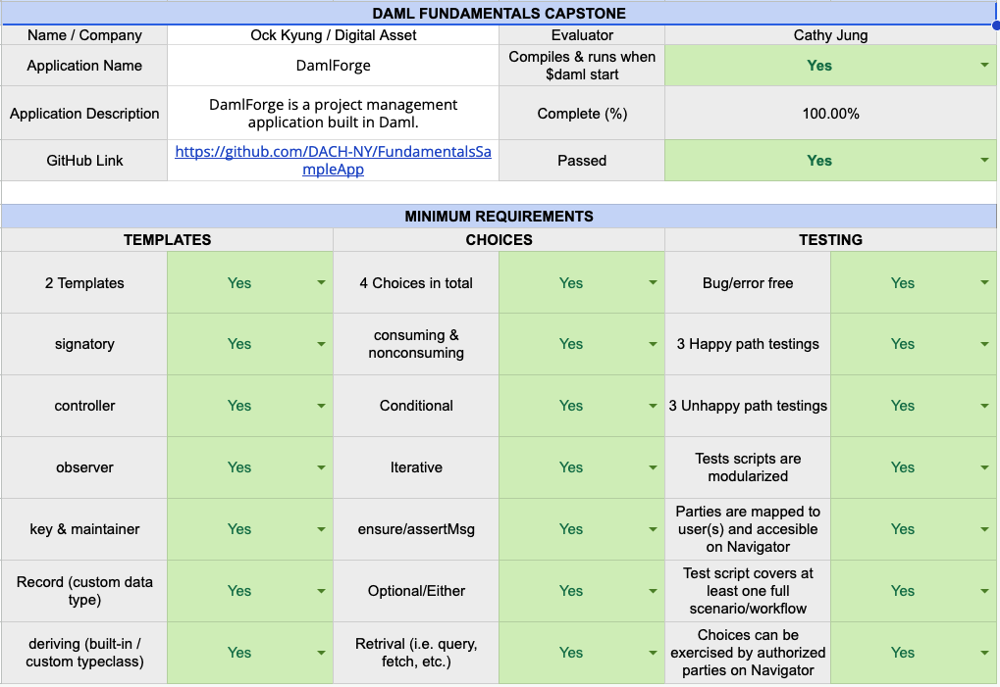

# Disclaimer

**The purpose of this directory is to provide clear instructions and guidelines for Daml learners to pass the Daml Fundamentals certification via their capstone project. Please bear in mind that any code within is provided for illustrative purposes only, and as such may not be production quality and/or may not fit your use-cases. You may use the contents of this directory in parts or in whole according to the BSD0 license:**

---

# Daml Fundamentals Certificate Sample App

✨ Welcome to the Daml Fundamentals Certification Sample App! ✨

As part of the certification process, you will be required to complete a backend-only capstone project that demonstrates your understanding of the material covered throughout the Daml Fundamentals Certification Path. You have the freedom to choose the topic of your project as long as it fulfills the criteria specified below. 

**The project must include the following components that are fully operational:**



🚨 **IMPORTANT NOTE** 🚨
1. Ensure that the **`$ daml start` command executes without errors. In the event of errors during the compilation process, the capstone project will not be evaluated.**

2. Follow the format of the sample project's README to create **a unique README tailored to your project.** Include your project's purpose, functionalities, implementation details, compilation instructions, test running instructions, and dependencies.

3. Commit and push your original work to your repository, **avoiding forking or cloning Digital Asset's sample project.** This prevents Digital Asset staff members from appearing as collaborators on your repository.

4. **Annotate your code** to highlight key functionalities and provide clear context.

5. Maximize your score by fully integrating all rubric components into the application workflow. Failure to incorporate defined items, such as records and typeclasses, into the business logic will result in point deductions.

To assist with your capstone project preparation, we provide a sample app as a guide. Analyze its code structure, functionality, and test script as you work towards your certification. Happy coding!

---

# 🛠️ DamlForge 🛠️ 
DamlForge is a project management application built in Daml.

### I. Overview 
This project was created by using the `empty-skeleton` template. The project adopts and exemplifies the `proposal-accept` design pattern. 

Proposer can create a ProjectProposal contract. Evaluator can exercise ProposerAccomplishments to confirm if the proposer is ready to take on the new project. Evaluator can either Reject or Approve the proposal. Upon getting rejected, proposer can exercise Revise to re-propose the project with updated details. Upon getting approved, a Project contract is created, which then evaluator can Evaluate to create an Accomplishmen contract with, if the Project contract is considered ready to be published.


### II. Workflow
  1. proposer creates a ProjectProposal contract     
  2. evaluator exercises ProposerAccomplishments to check proposer's past accomplishments and confirm if proposer is ready to take on a new responsibility
  3. evaluator exercises Reject with a feedback: "Aim to finish it by the end of March"
  4. proposer exercises Revise with an updated endDate (March 25, 2023)
  5. evaluator exercises Approve - a Project contract is created
  6. evaluator exercises Evaluate and decides that it's ready to be published - an Accomplishment contract is created

### III. Challenge(s)
* `controller ... can` syntax causes warning in Daml 2.0+. The code itself does not cause any issues/errors in 2.5.0 but according to the warning, the syntax will be deprecated in the future versions of Daml. More information [here](https://docs.daml.com/daml/reference/choices.html#daml-ref-controller-can-deprecation).
* The new controller syntax requires a controller to be an observer first before they can exercise a choice, otherwise it'll throw an error: "Attempt to fetch or exercise a contract not visible to the committer." For more information, check out [this post](https://discuss.daml.com/t/error-attempt-to-fetch-or-exercise-a-contract-not-visible-to-the-committer/1304/1) on the Daml Forum.
* The project was created by using `empty-skeleton` and the following was removed from `daml.yaml`:
```
sandbox-options:
   - --wall-clock-time
```
and the following was added:

```
exposed-modules:
  - Main
```
For more info, check out [this post](https://discuss.daml.com/t/sandbox-options-wall-clock-time/5692/16?u=cathy_jung) on Daml Forum and [Daml Doc](https://docs.daml.com/tools/navigator/index.html?&_ga=2.48248804.337210607.1673989679-241632404.1672853064&_gac=1.17025355.1673455980.CjwKCAiA2fmdBhBpEiwA4CcHzfI2w1_D95zAr3_d6QTypOMXGTpUxtS06c55inucNwZvUZn4AebsJxoCZEgQAvD_BwE&_gl=1*elem6v*_ga*MjQxNjMyNDA0LjE2NzI4NTMwNjQ.*_ga_GVK9ZHZSMR*MTY3Mzk5NDQzOS4zMS4xLjE2NzM5OTQ3MDcuMC4wLjA.#logging-in-as-a-party).


### IV. Compiling & Testing
To compile and test, run the pre-written script in the `Test.daml` under /daml OR run:
```
$ daml start
```
